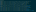

# Termsnap 📸

**Create SVGs from terminal output**

Termsnap turns terminal output into vector graphics. It uses an in-memory
instance of [Alacritty](https://github.com/alacritty/alacritty) under the hood
to be compatible with many terminal control sequences.

## Examples

### `termsnap -l 12 -c 60 -- ls -l --color=always`

### `termsnap -l 12 -c 60 -- nvim ... ./script/example.py`

