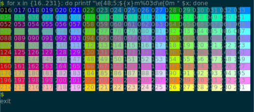
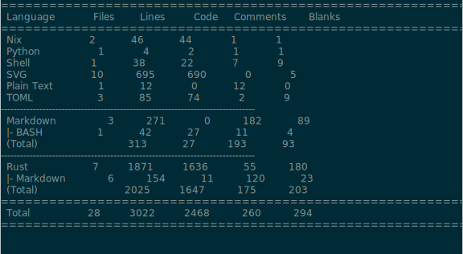

<div align="center">

# Termsnap 📸

**Create SVGs from terminal output**


[](https://crates.io/crates/termsnap)
[](https://github.com/tomcur/termsnap/actions)

</div>

Termsnap turns terminal output into vector graphics. It uses an in-memory
instance of [Alacritty](https://github.com/alacritty/alacritty) under the hood
to be compatible with many terminal control sequences.

## Usage

See `$ termsnap --help` for CLI usage documentation. For example, to run the
`ls` command and store the output in an SVG file, run:

```bash
$ termsnap -- ls -l > ./out.svg
```

## Examples

These examples are generated by [./scripts/examples.sh](scripts/examples.sh).
Note some of these examples send automated input to an interactive bash
session.

### Cowsay

```bash
$ termsnap --lines 9 --columns 28 -- cowsay Hello, world
```


### Neovim

```bash
# On exit, for some terminals, Neovim clears the terminal screen by swapping
# back to the main terminal screen buffer. The `--render-before-clear` argument
# renders the terminal screen as it was just prior to that swap occurring.
$ termsnap --lines 12 --columns 60 --term alacritty --render-before-clear -- nvim --clean ./scripts/example.py <<EOF
:set number
:syntax enable
:q
EOF
```


### ANSI colors

```bash
$ (
    # `sleep` gives bash time to be ready for the command, if this is omitted
    # the appearance of prompts can get messed up.
    sleep 0.05
    echo -ne "for x in {16..231}; do printf \"\\\e[48;5;\${x}m%03d\\\e[0m \" \$x; done\r"
    sleep 0.05
) | termsnap --lines 16 --columns 72 -- bash --noprofile --rcfile "$PWD/scripts/inputrc"
```



### TTY information

```bash
$ (
    sleep 0.05
    printf "echo \$-\r"
    sleep 0.05
    printf "tty\r"
    sleep 0.05
) | termsnap --lines 12 --columns 60 -- bash --noprofile --rcfile "$PWD/scripts/inputrc"
```


### Tokei

```bash
$ termsnap --lines 22 --columns 80 -- tokei
```



## Installation

Install using Cargo:

```bash
$ cargo install termsnap

# Run ls
$ termsnap --columns 80 --lines 36 -- ls --color=always -l

# Run an interactive bash session
$ termsnap --interactive --out ./interactive-bash.svg -- bash
```

Run using Nix flakes:

```bash
# Run ls
$ nix run github:tomcur/termsnap -- --columns 80 --lines 36 -- ls --color=always -l

# Run an interactive bash session
$ nix run github:tomcur/termsnap -- --interactive --out ./interactive-bash.svg -- bash
```

## A note on fonts

The SVG generated by Termsnap assumes the font used is monospace with a glyph
width/height ratio of 0.60 and a font ascent of 0.75. The font is not
embedded and the text not converted to paths. If the client rendering the SVG
can't find the specified font, the SVG may render incorrectly, especially if
the used font's dimensions do not match Termsnap's assumptions. You can use,
e.g., Inkscape to convert the text to paths---the downside is the text may lose
crispness when rendering at low resolutions. You can also convert the SVG to a
raster image.

```bash
# Text to path
$ inkscape --export-text-to-path --export-plain-svg --export-filename=./out.svg ./in.svg

# Render to raster image
$ inkscape --export-width=800 --export-filename=./out.png ./in.svg
```
