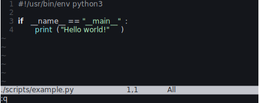
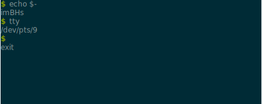

<div align="center">

# Termsnap 📸

**Create SVGs from terminal output**

</div>

Termsnap turns terminal output into vector graphics. It uses an in-memory
instance of [Alacritty](https://github.com/alacritty/alacritty) under the hood
to be compatible with many terminal control sequences.

## Examples






## A note on fonts

The SVG generated by Termsnap assumes the font used is monospace with a glyph
width/height ratio of 0.60 and a font ascent of 0.75. The font is not
embedded and the text not converted to paths. If the client rendering the SVG
can't find the specified font, the SVG may render incorrectly, especially if
the used font's dimensions do not match Termsnap's assumptions. You can use,
e.g., Inkscape to convert the text to paths---the downside is the text may lose
crispness when rendering at low resolutions. You can also convert the SVG to a
raster image.

```bash
# Text to path
$ inkscape --export-text-to-path --export-plain-svg --export-filename=./out.svg ./in.svg

# Render to raster image
$ inkscape --export-width=800 --export-filename=./out.png ./in.svg
```
